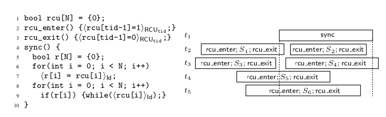

### A abstract Read-Copy-Update (RCU) in Nim

`abstract_rcu.nim` is based on _'Verifying Concurrent Memory Reclamation Algorithms with Grace'_ (2013) by Alexey Gotsman, Noam Rinetzky, and Hongseok Yang

received 2022-07 from [PDF online](https://software.imdea.org/~gotsman/papers/recycling-esop13-ext.pdf)

`abstract_rcu.nim` is strictly a proof-of-concept and not intended for other purposes than exploring, testing and understanding the concept behind Read-Copy-Update and Hazard-Pointers. A formal proof of correctness is included in the above cited work.
In Figure.2 the authors show the conceptual algorithm of RCU. This is covered in `src/abstract_rcu.nim`.
[Figure.3](src/ds_rcu/counter.md) shows a Counter-type with RCU-memory-reclamation. `src/ds_rcu/counter.nim` tries to implement the counter. More concurrent data-structures might follow, if it turns out that Nim is a suitable workbench for such developments.

Further information on RCU :
  - [Wikipedia]( https://en.wikipedia.org/wiki/Read-copy-update) [ en.wikipedia.org/wiki/Read-copy-update ]
  - McKenney, Walpole, 2007, _'What is RCU, fundamentally?'_, Linux Weekly News [ http://lwn.net/Articles/262464/ ]

#### Figure.2, page-7

