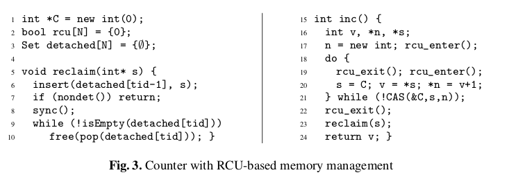

A abstract Read-Copy-Update (RCU) in Nim
=======================================

`abstract_rcu.nim` is based on _'Verifying Concurrent Memory Reclamation Algorithms with Grace'_ (2013) by Alexey Gotsman, Noam Rinetzky, and Hongseok Yang

received 2022-07 from [PDF online](https://software.imdea.org/~gotsman/papers/recycling-esop13-ext.pdf)

`abstract_rcu.nim` is strictly a proof-of-concept and not intended for other purposes than exploring, testing and understanding the concept behind Read-Copy-Update and Hazard-Pointers. A formal proof of correctness is included in the above cited work.
In Figure.2 the authors show the conceptual algorithm of RCU. This is covered in `abstract_rcu.nim`.
Figure.3 shows a Counter-type with RCU-memory-reclamation. `counter.nim` tries to implement this. More concurrent data-structures might follow, if it turns out that Nim is a suitable workbench for such developments.

Further information on RCU :
  - [Wikipedia]( https://en.wikipedia.org/wiki/Read-copy-update) [ en.wikipedia.org/wiki/Read-copy-update ]
  - McKenney, Walpole, 2007, _'What is RCU, fundamentally?'_, Linux Weekly News [ http://lwn.net/Articles/262464/ ]

Figure-2 from page 7
---------------------

Changes and limitations to the Pseudo-/C-code
----------------------------------------------

- all RCU-related procedures are prefixed `rcu_`
- renamed:
  - procedure `sync` to `rcu_synchronize`.
  - the `r`-array-of-bool to `registered` from procedure-`sync` resp. `rcu_synchronize`.
- added `rcu_register`/`rcu_unregister`-procedures to register threads wanting to participate in RCU.
- will break with runtime-error, in case :
  - more than four threads attempts to register.
  - a not formerly registered thread tries to participate.
- added `rcu_info`-procedure for logging.
- added a Thread-Array `TArray`-struct :
  - it is fixed-sized `N=4`. So at most four threads can participate.
  - keeps the thread's id from the operating-system in member `TArray.os_id`.
  - keeps the `rcu[N]`-array-of-bool in member `TArray.slots`.

Figure-3 'Counter' from page 7
------------------------------

WIP see [TODO.md]( TODO.md ).
